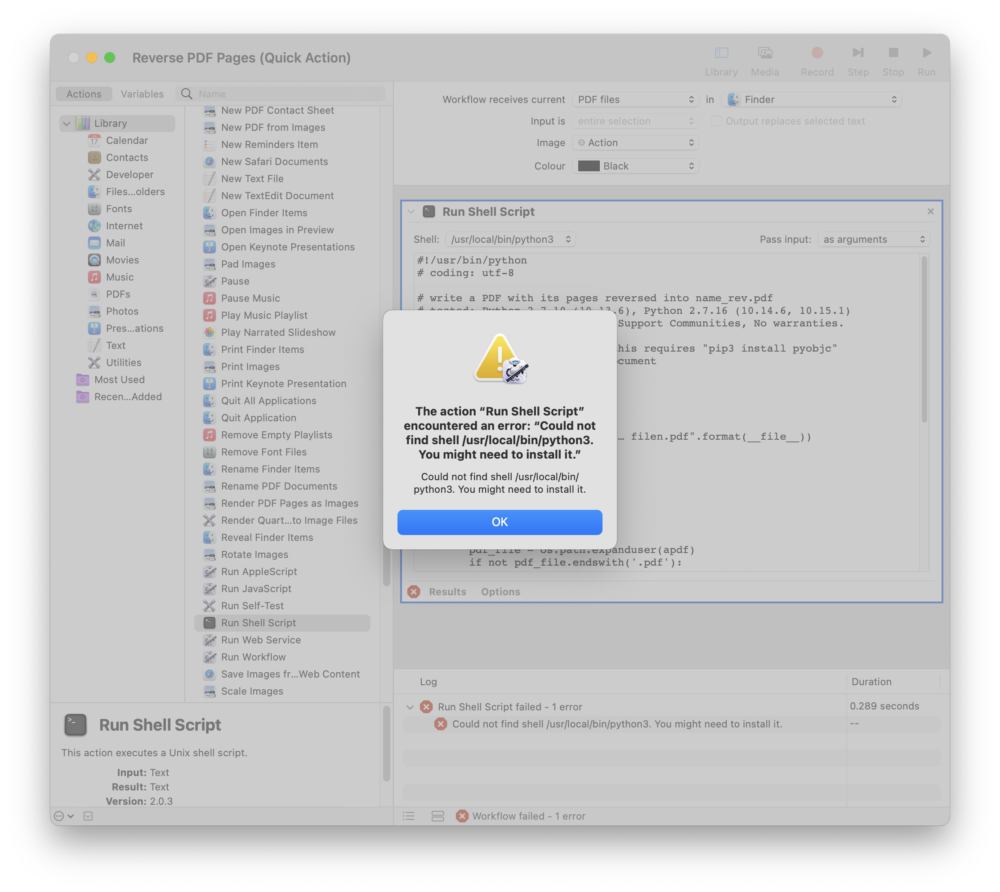

# Python scripts to reverse the order of the PDF pages

## Python script + Apple's Automator as an App(preferred)
Here is a Python script that takes one or more PDF files on its command-line and writes each document's reversed pages into a new document with "_reversed" appended to the filename (e.g. foo.pdf => foo_reversed.pdf). This requires the System Python because it is using the Apple PDFKit framework. This is adaptable to an Automator Run Shell Script with passed PDF file arguments. As long as Apple continues to provide a System Python that has Cocoa bridge support, this Python script [reverse_apple.py](src/mac/reverse_apple.py) will rapidly reverse the pages in one or more PDF (without modifying the original) and write *file.pdf* out as *file_rev.pdf* in the original filesystem location. 
* Note for this script to work it requires ```pyobjc```, if not already installed:
```
pip3 install pyobjc
```
It can be incorporated into a single Automator Run Shell Script action saved as either a drag/drop application on the Desktop, or as a Quick Action, so you can select one or more PDF in the Finder and with a right-click, choose Quick Actions -> Reverse PDF Pages.
### Automator (Quick Action):
#### Set up

#### Debugging: Note in macOS Monterey, you will encounter this error

To fix this, create Symlink to python3(installed by homebrew):
```
sudo ln -s /opt/homebrew/opt/python@3.10/bin/python3 /usr/local/bin/python3
```
the symbolic link `/usr/local/bin/python3` will be created and the link/pointer look like this: `/usr/local/bin/python3 -> /opt/homebrew/opt/python@3.10/bin/python3`

To remove the Symlink in the future, just run:
```
sudo rm /usr/local/bin/python3
```
Make sure there's no bug left and save

#### Usage in Finder


Alternatively download [Reverse PDF Pages](src/mac/Reverse%20PDF%20Pages.workflow) and open it. The default path to store this workflow is "/Users/luke/Library/Services/Reverse\ PDF\ Pages.workflow"
### Automator (Application):
NA
## Python script with [pdfrw](https://pypi.org/project/pdfrw/) package
* Note [reverse_pdf.py](src/reverse_pdf.py) script slightly reduces the size of the reversed pdf file compared to the original file size when tested.
### Usage
Package requirement:
```
pip3 install pdfrw
```
then run 
```
python3 reverse_pdf.py file.pdf
```
## Python Script with [tkinter](https://docs.python.org/3/library/tkinter.html) package
### Usage
Package requirement:

via homebrew [python-tk](https://formulae.brew.sh/formula/python-tk@3.10):
```
brew install python-tk@3.10
```
then run 
```
python3 reverse_pdf_PyPDF2.py
```
to select file in the GUI to proceed
