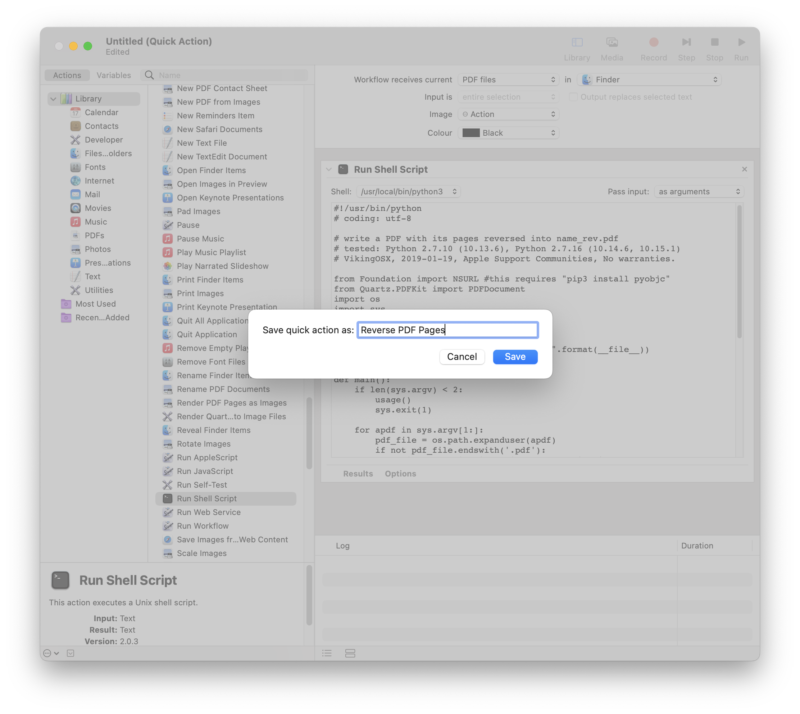
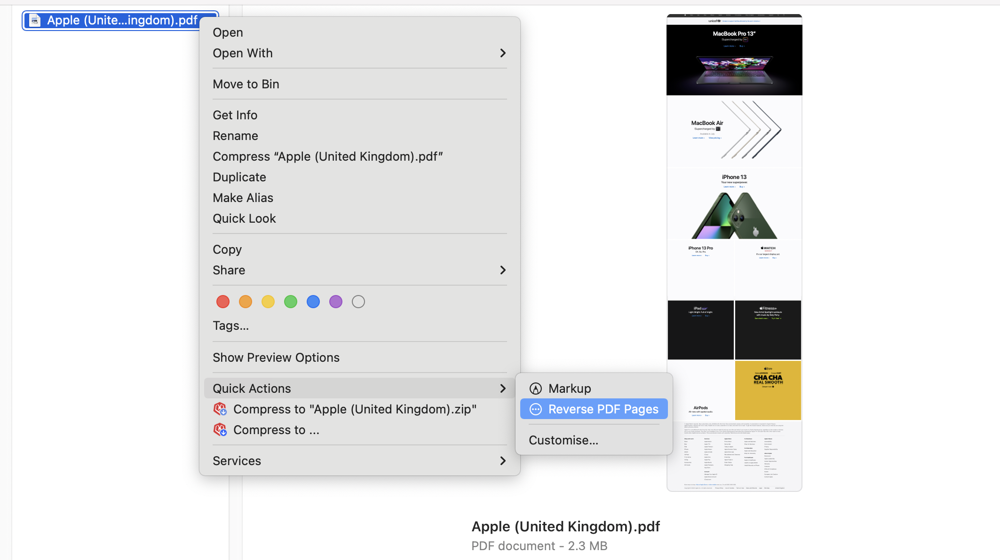

# Python scripts to reverse the order of the PDF pages
[](https://www.python.org/downloads/release/python-3105/)
[](https://pypi.org/project/pip/22.1.2/)

## [reverse_pdf_pdfrw.py](src/reverse_pdf_pdfrw.py)
* Note the reversed PDF file generated by this script is slightly reduced compared to the original file size when tested.
### Usage
Package requirement:
[pdfrw](https://pypi.org/project/pdfrw/)
```
pip3 install pdfrw
```
then run 
```
python3 reverse_pdf.py file.pdf
```
## [reverse_pdf_PyPDF2.py](src/reverse_pdf_PyPDF2.py)
* Note the reversed PDF file generated by this script is slightly reduced compared to the original file size when tested.
### Usage
Package requirement [tkinter](https://docs.python.org/3/library/tkinter.html):

For Debian-based Linux:
```
sudo apt-get install python-tk
```

via homebrew [python-tk](https://formulae.brew.sh/formula/python-tk@3.10):
```
brew install python-tk@3.10
```
then run 
```
python3 reverse_pdf_PyPDF2.py
```
to select a PDF file in the GUI to proceed

## [reverse_apple.py](src/mac/reverse_apple.py) + Apple's Automator
Here is a Python script that takes one or more PDF files on its command-line and writes each document's reversed pages into a new document with "_reversed" appended to the filename (e.g. foo.pdf => foo_reversed.pdf). This requires the System Python because it is using the Apple PDFKit framework. This is adaptable to an Automator Run Shell Script with passed PDF file arguments. As long as Apple continues to provide a System Python that has Cocoa bridge support, this Python script [reverse_apple.py](src/mac/reverse_apple.py) will rapidly reverse the pages in one or more PDF (without modifying the original) and write *file.pdf* out as *file_rev.pdf* in the original filesystem location. 
* Note for this script to work it requires ```pyobjc```, if not already installed:
```
pip3 install pyobjc
```
It can be incorporated into a single Automator Run Shell Script action saved as either a drag/drop application on the Desktop, or as a Quick Action, so you can select one or more PDF in the Finder and with a right-click, choose Quick Actions -> Reverse PDF Pages.
### Automator (Quick Action):
#### Set up

#### Debugging: Note in macOS Monterey, you may encounter [this error](Debug/README.md#shell-error-could-not-find-shell-usrlocalbinpython3) due to [Python 2.7 deprecation](https://developer.apple.com/documentation/macos-release-notes/macos-12_3-release-notes#Python)

Make sure there's no bug left and save


**Alternatively** download [Reverse PDF Pages](src/mac/Reverse%20PDF%20Pages.workflow) and open it. The default path to store this workflow is "/Users/<*your_user_name*>/Library/Services/Reverse\ PDF\ Pages.workflow"
#### Usage in Finder


### Automator (Application):
TBD

# Contributing
Any suggestions are welcome with a pull request. Either to expand this further or adding more functionalities.

# LICENSE
-----------------------------------------------------------------------------------
[MIT License](LICENSE)
